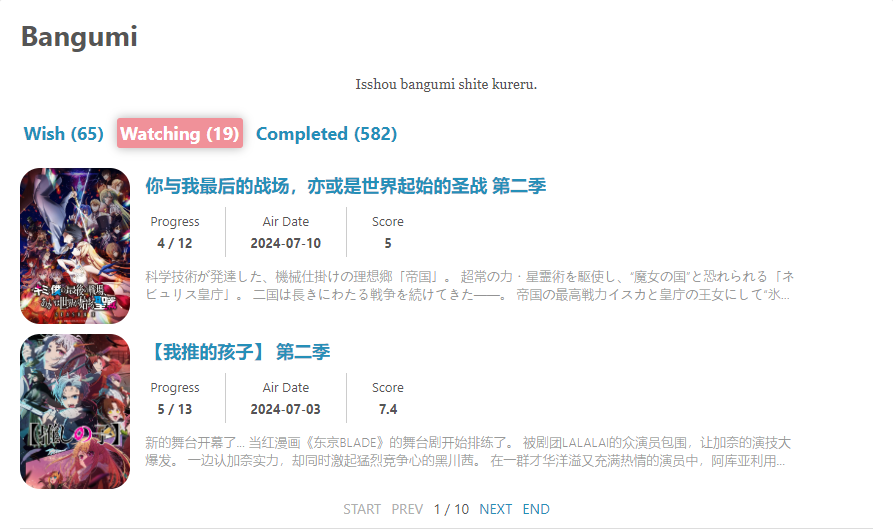

# Hexo Bangumi Gallery

[简体中文](./README.md) | English

A Hexo plugin, show your anime list in your blog. Support to get anime information from [bgm.tv](https://bgm.tv/) and [MyAnimeList](https://myanimelist.net/).

## Preview

There are two styles to choose for display. In `lite` mode, only the cover and *title (optional)* are displayed, while in `full` mode, more anime information will be displayed.

### lite mode

In `lite` mode, only the cover and title of the anime displayed. You can also choose to display only the cover.  
You can also configure the interval between anime and the number of anime displayed per page in the configuration file. This is described in detail in the configuration section below.


### full mode

In `full` mode, in addition to the cover and title, it will also display information such as introduction, number of episodes, ratings, air date, etc.


For the anime you are watching, you can choose whether to display the current progress in the anime information.
  
**ATTENTION: Due to the MyAnimeList API, you need to provide API Key when using MyAnimeList API to fetch anime information.
And when using MyAnimeList API to fetch anime information, you can only use `lite` mode.**

## Usage
1. Install the plugin  
   In the blog project directory, run the following command to install the plugin:
    ```shell
   npm install hexo-bangumi-gallery --save
   ```
   
2. Configuration
   Add the following configuration to the `_config.yml` file:
   ```yaml
    # Bangumi gallery
    bangumi_gallery:
      enable: true      # whether enable
      path: /bangumi.html      # path of bangumi gallery page
      api: 'mal'      # choose 'bgm' or 'mal' for bangumi source
      api_key: ''     # Optional. api key of mal
      user_id: 'chiyukiruon'
      display:
        index: 1      # the index tab to display. 0:planToWatch, 1: watching, 2: completed
        image_level: 'l'      # l, c, m, s, g
        size: 'lite'     # 'lite' or 'full'
        name: true      # whether display bangumi name with lite mode
        margin: 10      # margin of bangumi item
        page_size: 24     # number of bangumi to display per page
        progress: true      # whether display progress in watching tab with full mode
      title: 'Bangumi'      # title of bangumi gallery page
      quote: 'Isshou bangumi shite kureru.'      # quote of bangumi gallery page
   ```
   
3. Run

   After add the configuration correctly, run the server. When running for the first time, the plugin will automatically fetch the anime information and cache it locally.  
   After fetching the data, visit `http://localhost:4000/[path]` and you should be able to see the bangumi gallery page.  
   If you want to update the anime data, run the following command in project directory, and the anime data will be updated and cached.
    ```shell
   hexo bangumi-gallery -u
   ```
   
## Thanks
- [Hexo](https://hexo.io/)
- [hexo-bangumis](https://github.com/mmdjiji/hexo-bangumis)
- [Bangumi API](https://bangumi.github.io/api/#/)
- [MyAnimeList API](https://myanimelist.net/apiconfig/references/api/v2)

## LICENSE
[MIT](./LICENSE)