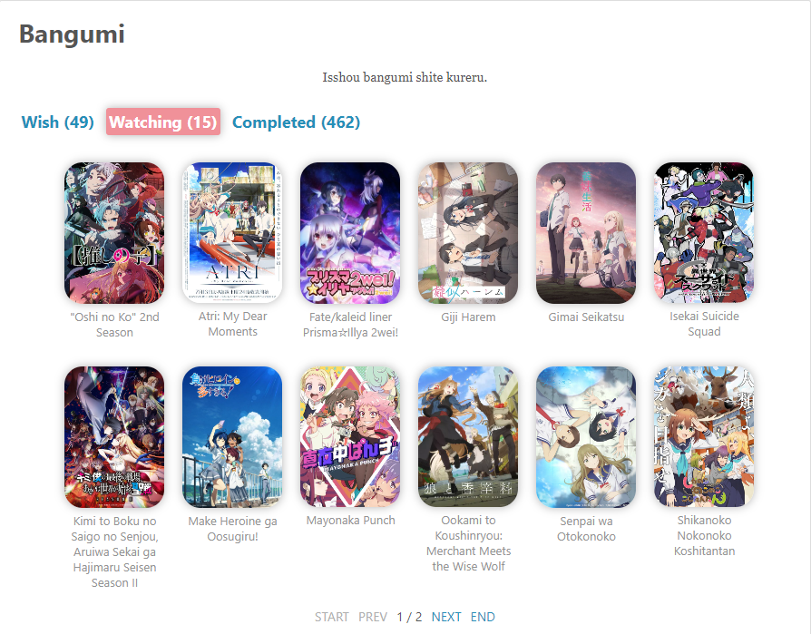

## Introduction

This is a anime list plugin for Hexo. It can display your favorite anime in your blog, including the anime you plan to watch, watching and watched. It supports getting anime information from [bgm.tv](https://bgm.tv/) and [MyAnimeList](https://myanimelist.net/).

## Preview

There are two styles to choose for display. In `lite` mode, only the cover and *title (optional)* are displayed, while in `full` mode, more anime information will be displayed.

### lite mode

In `lite` mode, only the cover and title of the anime displayed.  
You can configure the interval between anime and the number of anime displayed per page in the configuration file. This is described in detail in the configuration section below.

You can also choose to display only the cover.  

### full mode

In `full` mode, in addition to the cover and title, it will also display information such as introduction, number of episodes, ratings, air date, etc.

For the anime you are watching, you can choose whether to display the current progress in the anime information.

!> **NOTE:** When using MyAnimeList API to get anime information, you need to provide an API key. And since MyAnimeList API has some restrictions, when using MyAnimeList API, you can only use `lite` mode.
