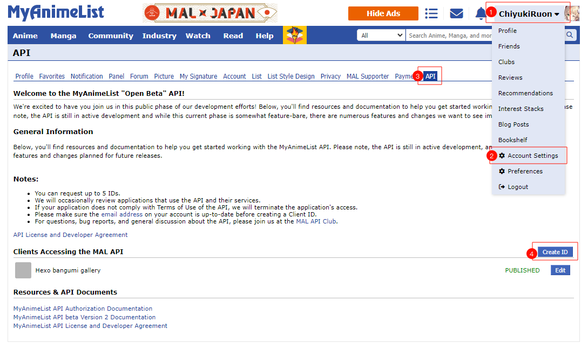

# Help <!-- {docsify-ignore} -->

## Bug & Suggestion

Please refer to [GitHub Issue](https://github.com/mmdjiji/hexo-bangumi-gallery/issues)

## Get MyAnimeList API Key

1. [Login](https://myanimelist.net/login.php) or [Sign up](https://myanimelist.net/register.php) your MyAnimeList account.  
2. Click your username in the upper right corner, select `Account Settings` in the drop-down menu, then click the `API` tab, and click the `Create ID` button on the page to apply a new API Key.  
     
3. Fill in the form with the appropriate information. You can fill as shown below or fill in your own information.  
     
4. After filling in the form, check the `I agree to the API License and Developer Agreement` button and click `submit` to generate the API Key.  
5. After submitting, you will return to the `API` tab, where you can see the client you just created. Click `Edit`, and `Client ID` is the API Key we need.  